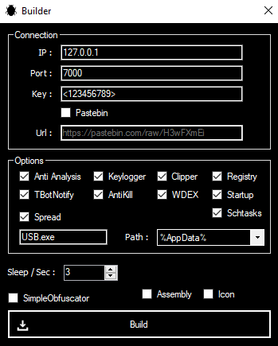
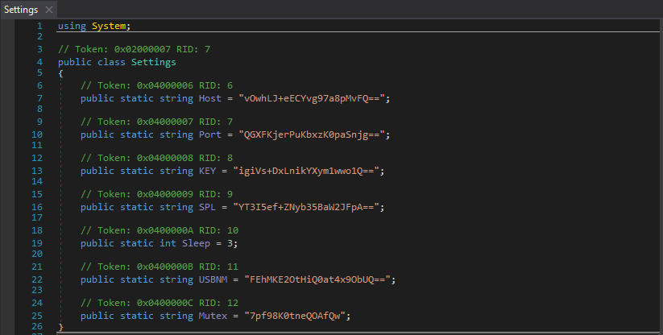
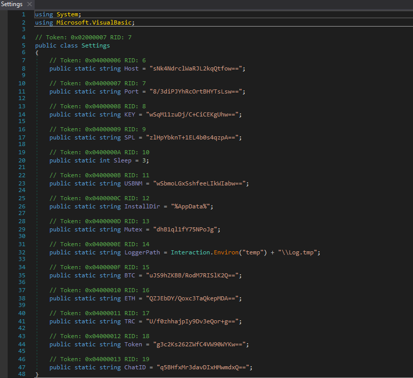
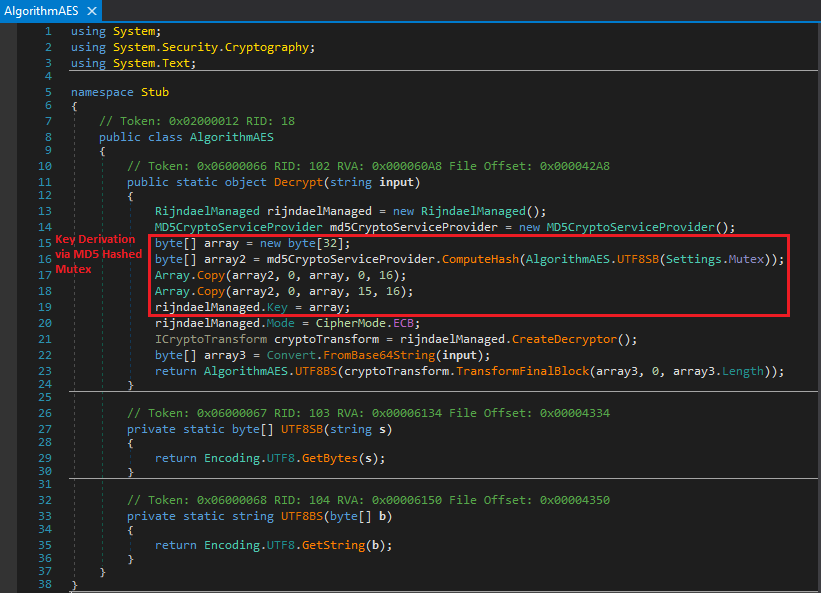
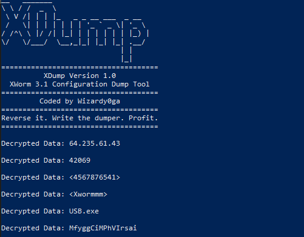
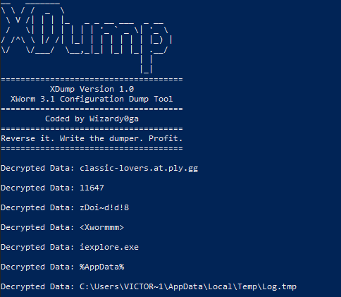
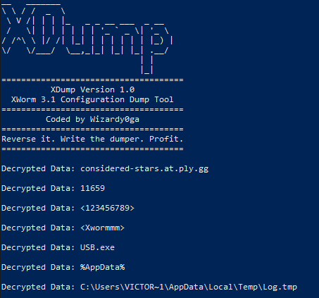

<p align="center">
  
</p>

<h1 align="center">
XDump
</h1>
<h6 align="center">
An XWorm 3.1 Configuration Dump Tool
</h6>


## Background Information

This tool will retrieve, decrypt and dump the configuration settings of an XWorm RAT Client. Please note that XWorm 3.1 was used during testing and creation of this tool.

## The XWorm Configuration

The XWorm Client contains various capabilities. The configuration that is set within this builder will be encrypted and placed in a class called Settings. This class has consistently appeared at token 0x02000007 across the samples i have looked at.

<h6 align="center">
XWorm Client Builder
</h6>
<p align="center">
  
</p>

When the client is configured without any options ticked, these are the standard that will be built into the client. 

<h6 align="center">
Basic Settings Decompilation
</h6>
<p align="center">
  
</p>

Building with the pastebin option results in the following decompilation of the settings class. There is an additional variable, PasteUrl and the host / port do not get configured. 

<h6 align="center">
Paste Bin Settings Decompilation
</h6>
<p align="center">
  
</p>

When building the client with all available options, the Settings class will be populated with some of that configuration data. 

<h6 align="center">
Full Settings Decompilation
</h6>
<p align="center">
  
</p>

## XWorm 3.1 Cryptographic implementation
To derive a key, XWorm will create an MD5 hash from a 16 character Mutex. This hash is used to create a 32 byte AES encryption key by copying the hash into the array twice. On the second copy operation, the last byte from the first copy pass is over-written leaving a null-byte at the end of the byte array.

Using this key, XWorm will decrypt it's configuration settings at the entry point of the program.

<p align="center">
  
</p>

## Usage

XDump takes a maximum of two arguments, one is mandatory and the other is not. The arguments are a file path to the XWorm client and an optional mutex. If a mutex is given, the program will derive a key from the mutex argument rather than retrieving the mutex from the assembly.

###### No Mutex
```
.\XDump.exe c:\path\to\xclient.exe
```

###### With Mutex
```
.\XDump.exe c:\path\to\xclient.exe some_mutex_abc
```

## Live Sample Examples

<p align="center">
  
</p>

<p align="center">
  
</p>

<p align="center">
  
</p>

# Requirements
| Item | Version |
| - | - |
| dnlib | 3.6.0 |
| .NET Framework | 4.7.2 |

# Created With
| Item | Version |
| - | - |
| Windows | 10 |
| Visual Studio | 2022 |
| XWorm | 3.1 |

